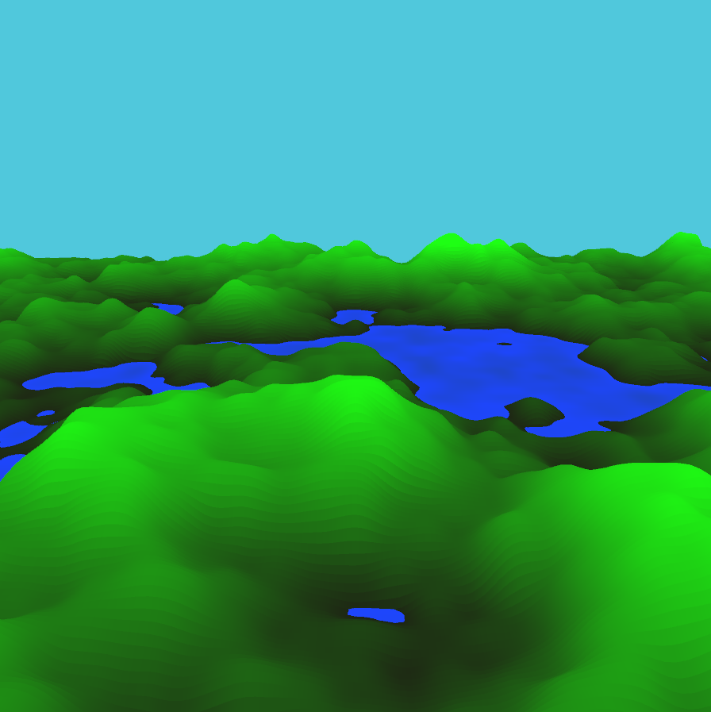
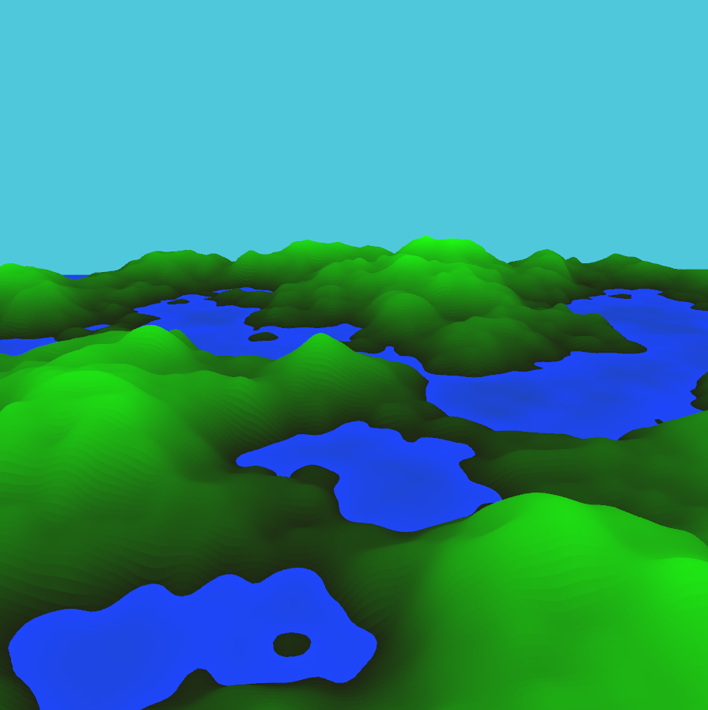
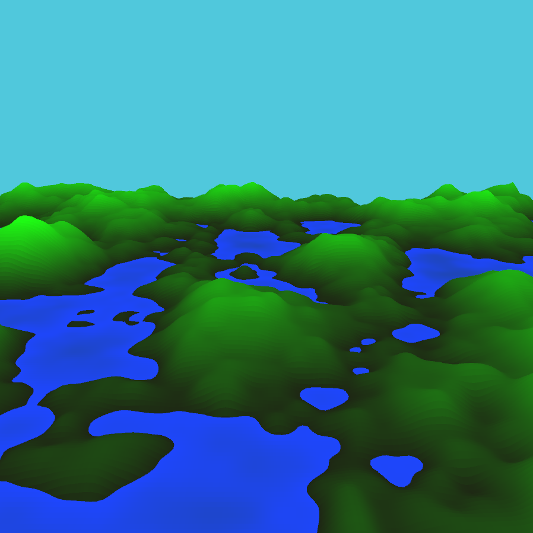

This program was inspired by a video I saw in youtube:
Coding Challenge 11: 3D Terrain Generation with Perlin Noise in Processing by TheCodingTrain
https://youtu.be/IKB1hWWedMk

I used this video to learn how to use processing 4, as well as to learn the basic logic behind Perlin Noise and how to use it to generate terrain.
This program generates terrain using perlin noise. You are able to fly through the terraing by using the arrow keys, and as you fly the program will generate new terrain.

Images:

  

